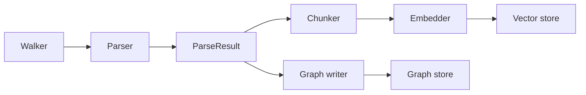

# Codebase Intelligence MCP — Design

This document records the architectural decisions behind the project. Each section is a decision: the question being answered, the options considered, what was chosen, and the tradeoff accepted. Decisions deferred to later versions are marked as such.

For the user-facing overview, see [README.md](./README.md).

---

## Goals and Non-Goals

**Goals.** Provide AI coding agents with persistent, structural knowledge of codebases that exceeds what fits in a single agent session. Specifically: structural queries (call graphs, blast-radius), semantic queries, and the ability to combine both. Designed for eventual cross-repo / internal-library use cases.

**Non-goals (for now).** Type-aware analysis, refactoring transforms, real-time indexing on every keystroke, IDE integration beyond MCP. Some of these are reachable later; none are v0.

---

## Two Stores: Why Both?

**Question.** Why maintain a vector store *and* a graph store, rather than picking one?

**Considered.**
- Vector-only. Simple, but cannot answer structural questions (transitive callers, blast-radius). Forces the agent to text-grep and reason over large samples.
- Graph-only. Fast for structural queries, but cannot answer fuzzy semantic questions ("find code that handles authentication") because matching depends on textual similarity, not explicit relationships.
- Both, with the agent choosing per query.

**Decision.** Both. Real questions about code mix structural and semantic shapes; serving them well requires both retrieval modes. The agent picks based on the tool description.

**Tradeoff.** Two storage systems to maintain, two ingestion paths, and a consistency invariant between them (see *Cross-Store Identity*). Accepted in exchange for retrieval quality across the full range of agent queries.

---

## Cross-Store Identity Invariant

**Question.** How do the two stores stay in sync, given that hybrid queries may pivot from a vector hit into a graph traversal?

**Constraint.** Vector entries must be a subset of graph nodes by canonical identifier (`qualified_name`). Every semantic hit must be loadable in the graph for follow-up structural queries.

**Invariant.** Each symbol has exactly one canonical identifier, produced deterministically from its structural facts (repo, module path, enclosing scope, name). The same symbol referenced from any code path — parser, chunker, graph writer, query layer — resolves to the same string.

**Enforcement (v0).** A single canonicalization function is the only path to producing the identifier; both stores derive their keys from it. Vector metadata is constructed from parser nodes via a single constructor, so vector entries cannot exist without a graph counterpart. Stronger structural enforcement (e.g., a dedicated identity type that cannot be constructed by string concatenation) is a v1 candidate if the convention proves fragile.

**Failure modes guarded against.**
- New embeddable kinds added to the chunker without graph counterparts.
- Reindexing leaving stale vectors pointing at obsolete graph nodes.
- Multiple naming schemes drifting apart.

**Tradeoff.** Forces upfront discipline around identity. In exchange, hybrid retrieval is reliable by construction — failures surface loudly rather than as silent mismatches.

---

## Pipeline Decomposition

**Question.** How is the indexing pipeline structured?

**Decision.** Four stages, each with one job:

- **Walker.** Filesystem traversal, file-type filtering, gitignore handling.
- **Parser.** Tree-sitter AST → structured `Node` and `Edge` lists. One source of truth for code structure.
- **Chunker.** Filters embeddable nodes, composes embed-text with cross-graph context, attaches metadata.
- **Graph writer.** Translates parser output into Neo4j nodes and relationships.

**Why this shape.** Single source of truth (parser) avoids parallel walkers drifting in what they extract. Stages are independently testable. Adding a new consumer of parser output (e.g., a documentation generator, an audit tool) is additive — no changes to existing stages.

**Tradeoff.** More files than a monolithic indexer. Accepted: the layering is what makes future extension cheap.

---

## What to Embed for a Function

**Question.** What text becomes the embedding for a function chunk?

**Considered.**
- Source only. Simplest, but embedding quality depends entirely on the embedding model's ability to reason about terse code. Often weak on queries that don't share vocabulary with the source.
- Source + module/class context. Adds locating signal — a `check` in `auth/validators.py` differs from a `check` in `forms/utils.py`, and the embedding should reflect that.
- Source + context + LLM-generated summary. Strongest, but requires an LLM call per chunk at index time.

**Decision (v0).** Source + file path + parent class + docstring. The chunker assembles these into the embedded text. LLM summaries deferred to v1.

**Why this isn't just metadata.** The same fields *also* appear in the vector entry's metadata, but the embedded-text copy serves a different purpose: it influences the *vector itself*, so two functions with identical bodies in different files produce distinguishable embeddings. Metadata is for filtering and pivoting; embedded text is for similarity.

**Deferred.** LLM-generated summaries (v1), oversized-function summarize-then-embed (v1), enrichment with cross-graph context like inherited docstrings or override relationships (v1).

---

## Symbol Resolution

**Question.** When the parser sees `helper.validate(order)`, what does it record?

**The four levels.**
1. The textual identifier `validate`.
2. The textual access `helper.validate`.
3. The import-resolved name `utils.helpers.validate`.
4. The actual definition node in `utils/helpers.py`.

**Decision (v0).** Level 1-2: record the textual reference. Resolution is deferred.

**Why.** Resolution is the dividing line between toy and production code-intelligence tools, and it grows in complexity (textual → import-aware → type-aware → cross-language). Building it into the parser couples extraction speed to resolution complexity, and forces every smartness improvement to re-traverse the AST.

**Plan.** A separate resolution pass over the graph after extraction. Edges are rewritten in place from textual targets to canonical `qualified_name` targets. Smartness improvements live entirely in the resolution pass.

**Tradeoff.** v0 graph queries against unresolved edges return weaker results — `find_callers(validate)` may return any function calling something named `validate`, regardless of which one. Acceptable for v0 demo on small repos; the resolution pass closes the gap.

---

## MCP Tool Surface

**Question.** What tools does the MCP server expose, and at what granularity?

**Considered.**
- A few high-level composite tools (e.g., `analyze_change_impact`). Easier for the agent; less flexible.
- Many primitive tools (`find_callers`, `find_callees`, `find_imports`, ...). More flexible; agent has to plan compositions.
- A small primitive surface, with composite tools added later based on observed usage.

**Decision (v0).** Three primitives: `find_definition`, `find_usages`, `semantic_query`. Each is precisely typed (Pydantic return models) so the agent's tool-call contract is unambiguous.

**Treat tool descriptions as prompt engineering.** Docstrings instruct the agent on when to pick a tool. Vague docstrings produce wrong tool calls; precise ones don't. Iterating on docstrings is part of the work, not documentation polish.

**Deferred.** Composite tools, identified empirically by watching the agent use the primitives. Decision intentionally deferred until there's data to drive it.

---

## Embedding Backend

**Question.** Which embedding model?

**Decision.** Swappable backend, selected by config. v0 supports Hugging Face local models (default, free, fast iteration) and Amazon Bedrock Titan (when configured). LlamaIndex abstracts the difference; downstream code is identical.

**Why swappable.** Different deployment contexts have different constraints (privacy, cost, latency). The backend is the most model-quality-sensitive part of the system; freezing the choice early is premature.

---

## Deployment

**Question.** How is the system run?

**Decision (v0).** MCP server runs natively (stdio transport), spawned by the agent. Neo4j runs in `docker-compose`. Vector store is local Chroma persistence.

**Why not Docker for the MCP server.** Stdio MCP servers are launched as subprocesses by the agent; containerizing them adds cold-start cost without much gain at this stage.

**Deferred (v1+).** HTTP/SSE transport for hosted multi-user deployments. At that point, a Dockerfile for the server becomes useful.

---

## Open Questions

Decisions intentionally postponed until there's evidence to drive them.

- **Whether to embed `Class` nodes alongside their methods.** Risks duplicate retrieval; benefits class-level conceptual queries. Will revisit after v0 retrieval evals.
- **How aggressive to be on resolution depth.** Textual is cheap; type-aware is expensive. Where the value/cost line sits depends on observed query patterns.
- **Cross-repo schema.** Modeling internal-library consumption requires either repo-prefixed `qualified_name`s or a `Repo` node with `BELONGS_TO` edges. Both work; the choice will be informed by what queries are most common across repos.

---
